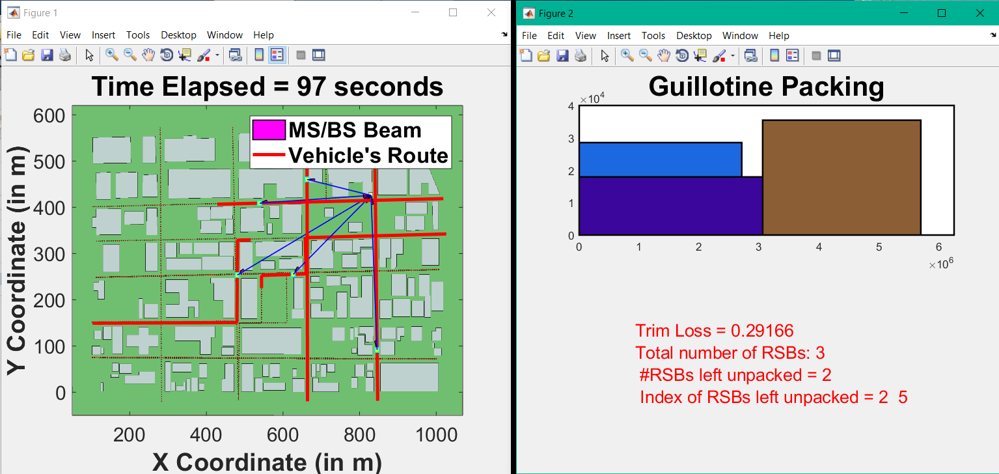

# mmWave-V2I-2DRBP
Source code for a MATLAB simulator to carry out link layer simulations for a mmWave V2I network in an LOS urban setting with low-rise modern buildings.

Since we do not have real-world 3D model of a section of a city, the 10 vehicle routes follow the gridlike street geography similar to NYC in Manhattan. We then displace the routes in the 2D plane using the LoadVehRouteData.m script to obtain as many routes as needed (say 50 vehicular routes) for the simulation.

File Description:

**2DRBP.exe** 
	The executable obtained by building the main.cpp from the bin packing C++ source  
**animationMmWaveV2I.m** 
	animate in 2D the movement of vehicles in its routes. The beam pointing direction is estimated in code using the x,y,z positions of both Tx and Rx antennas.  
**CitySectionAerialView.png** 
	Origin is bottom-left corner of the simulation window movement along the defined x, y, z axis  
**determinePacking.m** 
	wrapper in MATLAB for determining the packing for the bigger rectangle given the many smaller rectangles  
**generateRSB.m** 
	generates the two dimensions for the smaller rectangles  
**loadVehRouteData.m** 
	load as many vehicle routes as needed on to the workspace  
**plotArc.m** 
	displays the narrow beams for both the BS and MSs  
**vehicleBinPackSimulation.m** 
	THE CODE  
**vehicularRoutes.mat** 
	The 10 routes can be loaded from this .mat file  
**visualizePacking.m** 
	displays the packing as determined by the packing algorithm  

%%%%%%%%%%%%%%%%%%%%%%%%%%%%%%%%%%%%%%%%%%%%%%%%%% 
2D Rectangle Packing C++ Library: 
https://github.com/juj/RectangleBinPack 
Use a C++ compiler to build main.cpp 
 
To test the *.exe in MATLAB: 
!2DRBP 70 80 30 20 50 20 10 60 40 20 30 50 20 30 

This work is supported by **Cisco Systems, Inc**. I would like to thank Shyam Maniar, Senior Director, for his continued support on this project.

This code is licensed under the MIT license. Please feel free to use the code in your research and development works. We would appreciate a citation to the paper below when this code is helpful in obtaining results in your future publications. 

**Publication for citation:** 
R. Subramanian, "A Resource Allocation Scheme for Multi-User MmWave Vehicle-to-Infrastructure Communication," accepted for publication in the Future Technologies Conference (FTC) 2018, Vancouver, BC, Canada. 13-14 Nov. 2018.
